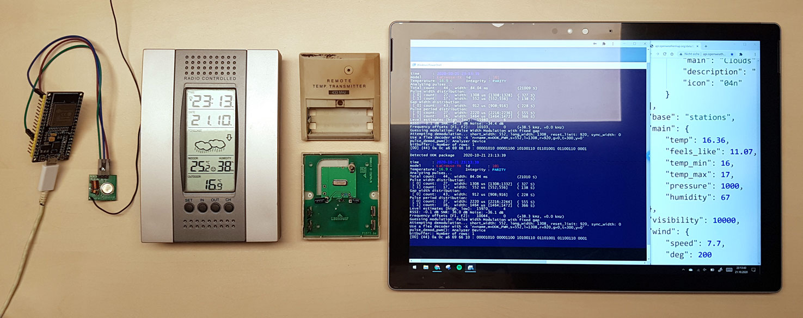

# Simulate433TemperatureSensor



**What?** This program requests the current temperature, for given coordinates, from OpenWeatherMap (App ID required, [it's free!](https://openweathermap.org/price)) and sends it with a 433MHz transmitter to a nearby (and cheap) weather station.

**Why?** Because I have some very well isolated windows, the outdoor sensor and station are not really reliable and connection losses occur. Additionally, the sensor is ~12 years old and started corroding a long time ago. Of course, I could just buy a new sensor, but that would be boring and I wouldn't have learned all these new things :)

**How?** See Explanation.


## Hardware

- ESP32 (e.g. from AZDelivery, but an ESP8266 should also work)
- XY-FST 433MHz transmitter
- Jumper wires, micro-USB cable, (power supply)
- Weather station with 433MHz receiver and La Crosse TX Protocol. I'm using a (Technoline) WS 7014 weather station from 2008 ([Manual](https://www.technoline-berlin.de/manual/WS-7014S-e(1).pdf)).


## Get started

1. Connect transmitter as followed

| ESP32 | XY-FST Transmitter |
| :---: | :----------------: |
|  GND  |         -          |
|  3V3  |         +          |
|  G4   |        DATA        |

(Note: Pinout of ESP32 can be labeled differently. I have to use [this pinout](https://cdn.shopify.com/s/files/1/1509/1638/files/ESP_-_32_NodeMCU_Developmentboard_Pinout_Diagram.jpg).)

Advice: Uncoil the antenna for a better range. You can even trim it from a length of 25cm to 17.3cm ([Source](https://www.thethingsnetwork.org/forum/t/antenna-length-for-868-and-433-mhz/5378)).

2. Open `Simulate433TemperatureSensor.ino` with your favorite IDE (Arduino IDE, VS Code, ...)
3. Install missing libraries
4. Change the code regarding your coordinates, OpenWeatherMap App ID and WiFi credentials
5. Upload the code to your micro-controller
6. Connect micro-controller to power supply
7. Wait until your weather station was able to read the signal. May happen in an interval of 5 minutes.


## Explanation / Workflow

At first, I had to analyze the signal that is transmitted by the original sensor. For this I've used `rtl_433`  ([GitHub](https://github.com/merbanan/rtl_433)) and a RTL-SDR/DVB-T-Stick attached to my computer, running the command `rtl_433 -g 50 -A -G 4`:

```
Detected OOK package    2020-09-27 23:45:42
_ _ _ _ _ _ _ _ _ _ _ _ _ _ _ _ _ _ _ _ _ _ _ _ _ _ _ _ _ _ _ _ _ _ _ _ _ _ _ _ _ _ 
time      : 2020-09-27 23:45:42
model     : LaCrosse-TX  id        : 96
Temperature: 21.2 C      Integrity : PARITY
Analyzing pulses...
Total count:   44,  width: 84.96 ms             (21241 S)
Pulse width distribution:
 [ 0] count:   28,  width: 1300 us [1296;1312]  ( 325 S)
 [ 1] count:   16,  width:  552 us [548;556]    ( 138 S)
Gap width distribution:
 [ 0] count:   43,  width:  920 us [916;928]    ( 230 S)
Pulse period distribution:
 [ 0] count:   28,  width: 2224 us [2216;2240]  ( 556 S)
 [ 1] count:   15,  width: 1472 us [1468;1480]  ( 368 S)
Level estimates [high, low]:   2636,     44
RSSI: -7.9 dB SNR: 17.8 dB Noise: -25.7 dB
Frequency offsets [F1, F2]:   20941,      0     (+79.9 kHz, +0.0 kHz)
Guessing modulation: Pulse Width Modulation with fixed gap
Attempting demodulation... short_width: 552, long_width: 1300, reset_limit: 932, sync_width: 0
Use a flex decoder with -X 'n=name,m=OOK_PWM,s=552,l=1300,r=932,g=0,t=296,y=0'
pulse_demod_pwm(): Analyzer Device
bitbuffer:: Number of rows: 1
[00] {44} 0a 0c 17 12 71 90 : 00001010 00001100 00010111 00010010 01110001 1001
```

This is a very good sign! We obtain useful information like that it's an OOK package, a LaCrosse-TX protocol is used, the temperature was also detected, we get the Pulse/Gap width distributions and the binary code.

Instead of receiving a signal, we want to transmit it and, therefore, we have to learn how this binary code is created to be readable by weather stations and `rtl_433`. I found [this](https://www.f6fbb.org/domo/sensors/tx3_th.php) documentation very helpful and used it for my implementation of the La Crosse TX protocol. Take a look at the code - every line is commented.

Now that we know how to build this binary code, we have to transmit it and for this we'll be using OOK (On–off keying) modulation. Instead of just pulling a pin HIGH or LOW, depending on the bit, we have to modulate it into another "structure":

- 0 -> |‾‾‾‾|__ where the HIGH pulse lasts for **x** μs (microseconds)
- 1 -> |‾‾|__  where the HIGH pulse lasts for **y **μs (microseconds)
- both HIGHs are followed by the same LOW (gap) that lasts for **z **μs (microseconds)

Looking back at our output from `rtl_433` (Pulse/Gap width distributions), we obtain all these values and round them a little bit: **x** = 1300, **y** = 550, **z** = 920.

The attentive reader may notice that I've used different values in my code. That's because the ESP32 wasn't able to reach the correct timings, so I had to tweak the delays for several hours until it came close to the original sensor.

Now, let's take a look at our own signal:

```
Detected OOK package    2020-09-28 22:59:02
_ _ _ _ _ _ _ _ _ _ _ _ _ _ _ _ _ _ _ _ _ _ _ _ _ _ _ _ _ _ _ _ _ _ _ _ _ _ _ _ _ _
time      : 2020-09-28 22:59:02
model     : LaCrosse-TX  id        : 101
Temperature: 12.2 C      Integrity : PARITY
Analyzing pulses...
Total count:   44,  width: 86.43 ms             (21607 S)
Pulse width distribution:
 [ 0] count:   30,  width: 1288 us [1284;1304]  ( 322 S)
 [ 1] count:   14,  width:  540 us [540;548]    ( 135 S)
Gap width distribution:
 [ 0] count:   43,  width:  932 us [928;940]    ( 233 S)
Pulse period distribution:
 [ 0] count:   29,  width: 2220 us [2216;2236]  ( 555 S)
 [ 1] count:   14,  width: 1472 us [1468;1484]  ( 368 S)
Level estimates [high, low]:  15969,     39
RSSI: -0.1 dB SNR: 26.1 dB Noise: -26.2 dB
Frequency offsets [F1, F2]:   -6769,      0     (-25.8 kHz, +0.0 kHz)
Guessing modulation: Pulse Width Modulation with fixed gap
Attempting demodulation... short_width: 540, long_width: 1288, reset_limit: 944, sync_width: 0
Use a flex decoder with -X 'n=name,m=OOK_PWM,s=540,l=1288,r=944,g=0,t=296,y=0'
pulse_demod_pwm(): Analyzer Device
bitbuffer:: Number of rows: 1
[00] {44} 0a 0c a6 22 62 20 : 00001010 00001100 10100110 00100010 01100010 0010
```

Pulse/Gap width distributions are still not perfect, but `rtl_433` is able to detect and decode our OOK package, i.e. that the weather station should also be able to detect and decode it!

Notice: The IDs are different (96 != 101) because I've used the binary code from another signal and hard-coded its ID into the code. The original sensor generates a new ID on every restart (removing/inserting batteries).

Now I'm able to see the current outside temperature, that is provided by OpenWeatherMap and was transmitted over 433MHz from a micro-controller to my weather station!

### Troubleshooting

Although all of this works most of the time, it's still not reliable enough...

I still don't now what causes this issue, but sometimes OOK packages are sent that are not detected by `rtl_433` and my weather station:

```
Detected OOK package    2020-09-28 22:50:05
Analyzing pulses...
Total count:   44,  width: 84.96 ms             (21239 S)
Pulse width distribution:
 [ 0] count:   28,  width: 1288 us [1284;1304]  ( 322 S)
 [ 1] count:   16,  width:  544 us [540;552]    ( 136 S)
Gap width distribution:
 [ 0] count:   43,  width:  932 us [928;940]    ( 233 S)
Pulse period distribution:
 [ 0] count:   28,  width: 2220 us [2212;2232]  ( 555 S)
 [ 1] count:   15,  width: 1476 us [1472;1484]  ( 369 S)
Level estimates [high, low]:  15889,     22
RSSI: -0.1 dB SNR: 28.6 dB Noise: -28.7 dB
Frequency offsets [F1, F2]:   -6577,      0     (-25.1 kHz, +0.0 kHz)
Guessing modulation: Pulse Width Modulation with fixed gap
Attempting demodulation... short_width: 544, long_width: 1288, reset_limit: 944, sync_width: 0
Use a flex decoder with -X 'n=name,m=OOK_PWM,s=544,l=1288,r=944,g=0,t=296,y=0'
pulse_demod_pwm(): Analyzer Device
bitbuffer:: Number of rows: 1
[00] {44} 0a 0c a6 23 62 30 : 00001010 00001100 10100110 00100011 01100010 0011
```

As you can see, the distributions are *nearly* identical, but somehow the protocol is not detected and no temperature read. Sometimes this happens for just a few iterations and sometimes it keeps failing for a few hours. I already tried to speed everything up (see comments in code) and also work with a Mutex, so the CPU is not interrupted during transmission. If someone knows how to improve this, I'd be very happy about a pull request!


## Future

Reliability and performance have the highest priority and I'll still try to improve the code. However, my weather station is able to receive up to three different (temperature) readings (using three different sensor IDs), so it should be possible to display different temperatures for different locations. Additionally, someone could display temperatures from a forecast, the amount of unread e-mails, amount of todays appointments, days until Christmas and so on.


## Other stuff I didn't mention

- In the beginning I implemented everything in Python to use it on a Raspberry Pi, but due to its relatively multitasked OS and many processes it's not possible to transmit a long sequence of bits and keep precise timings.
- I've also used URH (Universal Radio Hacker, [GitHub](https://github.com/jopohl/urh)) to take a look at the signals and to find the Pulse/Gap width distributions, but it was much easier with `rtl_433`.
- I had to use `rtl_433` with the argument `-g 50` because I wasn't able to detect any signals when it was set to `automatic gain (default)`.

